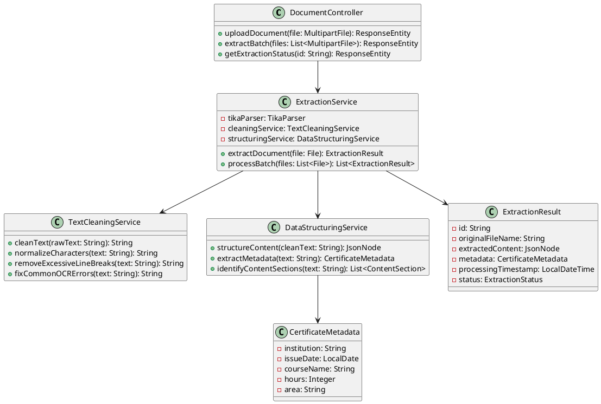
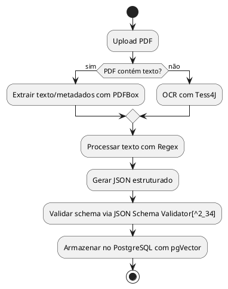

# Análise da Biblioteca Docling e Alternativas para Extração de Documentos em Java

A biblioteca Docling representa uma solução avançada da IBM para conversão de documentos que utiliza modelos de inteligência artificial especializados, oferecendo capacidades robustas de extração e estruturação de conteúdo. Para o desenvolvimento do Sistema GAD, considerando a necessidade de processar aproximadamente 1300 PDFs de certificados com até 10 páginas cada, é fundamental avaliar as melhores estratégias de implementação, formatos de saída e arquitetura de módulos para otimizar o processamento com OpenNLP.

## Características e Capacidades do Docling

O Docling é uma solução open-source desenvolvida pela IBM que se destaca por sua abordagem baseada em inteligência artificial para conversão de documentos[^1_2][^1_3][^1_11][^1_12]. A biblioteca utiliza modelos especializados de última geração, incluindo o DocLayNet para análise de layout e o TableFormer para reconhecimento de estrutura de tabelas[^1_3][^1_11]. Esta ferramenta foi projetada para funcionar eficientemente em hardware comum com orçamento de recursos limitado, oferecendo uma interface de código que permite fácil extensibilidade e adição de novos recursos e modelos[^1_3][^1_11].

A biblioteca possui licença MIT e está disponível como um pacote Python que pode ser usado tanto como API Python quanto como ferramenta de linha de comando[^1_12]. O Docling já foi integrado em outros frameworks open-source populares como LangChain, LlamaIndex e spaCy, tornando-se uma escolha natural para processamento de documentos e desenvolvimento de aplicações avançadas[^1_2][^1_12]. A comunidade open-source adotou amplamente a ferramenta, que conquistou 10.000 estrelas no GitHub em menos de um mês e foi reportada como o repositório número 1 em tendências mundiais no GitHub em novembro de 2024[^1_2][^1_12].

## Alternativas em Java para Extração de Documentos

Para o ecossistema Java, existem várias bibliotecas que oferecem funcionalidades similares ao Docling, embora com abordagens diferentes. O Apache Tika representa uma das soluções mais robustas e amplamente utilizadas para extração de texto de documentos PDF[^1_18]. Esta biblioteca Java fornece capacidades abrangentes de extração de metadados e conteúdo textual de diversos formatos de documento, incluindo PDF, e tem sido utilizada em estudos comparativos com sistemas de recuperação de informação[^1_18].

Outra alternativa relevante é o desenvolvimento de frameworks customizados baseados em regras para extração de metadados de artigos acadêmicos[^1_19]. Estudos demonstram que é possível criar sistemas Java de alto desempenho que são 9-10 vezes mais rápidos que sistemas existentes de extração de metadados, utilizando características de layout, fonte e tamanho do texto para extração de títulos, e conjuntos de regras fixas para outros campos como resumos, corpo do texto e referências[^1_19]. Estes sistemas podem armazenar metadados extraídos tanto em bancos de dados Oracle quanto em arquivos XML[^1_19].

O Giles Ecosystem oferece uma abordagem distribuída baseada em Apache Kafka para upload e extração de texto e imagens de documentos[^1_20]. Os componentes do sistema são implementados usando Java e Spring Framework, estando disponíveis sob licença Open Source[^1_20]. Esta solução foi especificamente desenvolvida para humanidades digitais, onde há necessidade constante de converter imagens e arquivos PDF em texto simples para aplicar análises como modelagem de tópicos e reconhecimento de entidades nomeadas[^1_20].

## Análise de Formatos de Saída para Integração com OpenNLP

A escolha do formato de saída para integração com OpenNLP requer análise cuidadosa das características de processamento e eficiência computacional. O formato JSON oferece vantagens significativas para o processamento com OpenNLP em comparação com markdown e texto simples, especialmente quando se considera a estruturação de dados e facilidade de consumo por algoritmos de processamento de linguagem natural.

O JSON permite estruturação hierárquica de dados extraídos, facilitando a preservação de metadados importantes como posição no documento, tipo de conteúdo (título, parágrafo, lista), e relações entre elementos. Esta estruturação é particularmente vantajosa para tarefas de OpenNLP como tokenização, reconhecimento de entidades nomeadas e classificação, pois permite que o algoritmo acesse não apenas o conteúdo textual, mas também informações contextuais sobre a estrutura do documento[^1_13][^1_16]. Estudos recentes demonstram que a utilização de dados estruturados em formato JSON melhora significativamente a precisão de modelos de linguagem em tarefas de extração de informação médica e geração de grafos de conhecimento[^1_13][^1_16].

O formato de texto simples (.txt), embora mais direto, resulta na perda de informações estruturais importantes que podem ser cruciais para a classificação precisa de certificados. O markdown, por sua vez, preserva alguma estrutura através de marcações, mas requer parsing adicional antes do processamento com OpenNLP, introduzindo uma etapa computacional desnecessária. A literatura científica indica que formatos estruturados como JSON reduzem a necessidade de pré-processamento e melhoram a acurácia de algoritmos de machine learning em tarefas de classificação de documentos[^1_13].

## Recomendações para o Módulo DocExtractor

Considerando o contexto específico do Sistema GAD, com aproximadamente 1300 PDFs de certificados de até 10 páginas cada, recomenda-se o desenvolvimento de um módulo DocExtractor customizado utilizando Apache Tika como base, complementado por técnicas de pré-processamento inspiradas nas abordagens do Docling. Esta estratégia oferece controle total sobre o processo de extração e permite otimizações específicas para o domínio de certificados acadêmicos.

O módulo deve implementar uma arquitetura em camadas utilizando Spring Framework, com separação clara entre responsabilidades de extração, limpeza e estruturação de dados. A camada de extração utilizará Apache Tika para extração bruta do texto, seguida por uma camada de pré-processamento que implementará técnicas de limpeza como remoção de quebras de linha excessivas, normalização de caracteres especiais, e correção de problemas comuns de OCR. A camada de estruturação organizará o conteúdo extraído em formato JSON, preservando metadados importantes como posição no documento e tipo de conteúdo.

A implementação deve incluir técnicas de validação e qualidade de dados, considerando que cada certificado terá apenas uma classificação independente de horas ou pontos. O sistema deve ser capaz de identificar e extrair automaticamente informações-chave como instituição emissora, data de emissão, carga horária, e área de conhecimento, estruturando essas informações em campos específicos do JSON de saída para facilitar o processamento posterior com OpenNLP.

## Arquitetura do Sistema de Extração

A arquitetura proposta para o módulo DocExtractor deve seguir o padrão MVC do Spring Framework, com controladores REST para upload de documentos, serviços de processamento assíncrono para extração em lote, e repositórios para persistência no PostgreSQL com extensão pgVector. O fluxo de processamento incluirá validação de entrada, extração com Apache Tika, limpeza e normalização de texto, estruturação em JSON, e armazenamento de resultados.

O diagrama de classes utilizando PlantUML para o módulo DocExtractor seria estruturado da seguinte forma:



O sistema de armazenamento utilizará PostgreSQL para persistir tanto os dados estruturados quanto os vetores de características extraídas usando pgVector, facilitando futuras consultas baseadas em similaridade. A integração com OpenNLP será otimizada através do formato JSON estruturado, que preservará informações contextuais importantes para melhorar a precisão da classificação de certificados.

## Conclusão

A análise das tecnologias disponíveis e dos requisitos específicos do Sistema GAD indica que o desenvolvimento de um módulo DocExtractor customizado utilizando Apache Tika como base, complementado por técnicas de pré-processamento e estruturação em JSON, representa a abordagem mais adequada. Esta solução oferece controle total sobre o processo, otimização para o domínio específico de certificados, e integração eficiente com OpenNLP, resultando em melhor qualidade de extração e classificação para os aproximadamente 1300 documentos a serem processados.

<div style="text-align: center">⁂</div>

[^1_1]: https://www.taylorfrancis.com/books/9781351033893

[^1_2]: https://arxiv.org/pdf/2501.17887.pdf

[^1_3]: http://arxiv.org/pdf/2408.09869.pdf

[^1_4]: http://www.tandfonline.com/doi/abs/10.1080/10447319509526110

[^1_5]: https://ieeexplore.ieee.org/document/9138680/

[^1_6]: https://ieeexplore.ieee.org/document/8413085/

[^1_7]: https://ieeexplore.ieee.org/document/8392693/

[^1_8]: http://ieeexplore.ieee.org/lpdocs/epic03/wrapper.htm?arnumber=7029183

[^1_9]: http://ieeexplore.ieee.org/lpdocs/epic03/wrapper.htm?arnumber=7442608

[^1_10]: https://ieeexplore.ieee.org/document/8392669/

[^1_11]: https://arxiv.org/abs/2408.09869

[^1_12]: https://arxiv.org/abs/2501.17887

[^1_13]: https://ascopubs.org/doi/10.1200/JCO.2025.43.16_suppl.e13685

[^1_14]: https://www.degruyter.com/document/doi/10.1515/zrp-2021-0029/html

[^1_15]: https://www.frontiersin.org/articles/10.3389/fmars.2024.1359563/full

[^1_16]: https://ascopubs.org/doi/10.1200/JCO.2025.43.16_suppl.e13704

[^1_17]: https://ieeexplore.ieee.org/document/10193915/

[^1_18]: https://www.nomos-elibrary.de/index.php?doi=10.5771/9783956504211-120

[^1_19]: https://www.semanticscholar.org/paper/6742f2a7515fb2f892f81db85af236326c6e6b7d

[^1_20]: https://openresearchsoftware.metajnl.com/article/10.5334/jors.164/

[^1_21]: https://www.semanticscholar.org/paper/7b5e31257f01aba987f16e175a3e49e00a5bd3bb

[^1_22]: https://www.taylorfrancis.com/books/9780429616327/chapters/10.4324/9780429056765-3

[^1_23]: https://www.semanticscholar.org/paper/21e4efbc3db797c29295f958d30e0a3feca60f72

[^1_24]: https://www.semanticscholar.org/paper/a184d615f972beeb1bc74083f5a0e2a7da01979d

[^1_25]: https://link.springer.com/10.1007/s00701-023-05625-3

[^1_26]: https://www.semanticscholar.org/paper/48bb615dee1ceb98fcdf9b227a142a6c1585f276

[^1_27]: https://www.semanticscholar.org/paper/7fa557a2d045af244912543c693907fec448cdae

[^1_28]: https://www.semanticscholar.org/paper/679c7c78ccab6e9174fb9b91c565b9c02e035629

[^1_29]: https://dl.acm.org/doi/10.1145/3220228.3220249

[^1_30]: https://arxiv.org/abs/2103.15348

[^1_31]: https://arxiv.org/abs/2503.13964

[^1_32]: https://www.semanticscholar.org/paper/e81a17fe65ded024645552fd24bb1b33817b2e35

[^1_33]: https://www.semanticscholar.org/paper/1b79bdbc74a867988d261f7f32d6fdddb1754ac4

[^1_34]: https://www.semanticscholar.org/paper/ae92b01a30c289583b43cc99c498aac5799cd4ca

[^1_35]: https://www.semanticscholar.org/paper/86358791a0973ca162a68a91caadc4593de12aa7

[^1_36]: https://www.semanticscholar.org/paper/ec8d8ec00c7c949218bc59d9f41575d81a2d30c1

[^1_37]: http://link.springer.com/10.1007/978-3-642-54906-9_9

[^1_38]: https://www.semanticscholar.org/paper/4b2d92d6e04cbdfd0dc9a10fa6f134fd5aa477c3

[^1_39]: https://www.semanticscholar.org/paper/d632839caac8e056cc5faff8171858d7f578e498

[^1_40]: https://www.semanticscholar.org/paper/661c5082952d606afc0a41f966d72bba8b89b2f4

[^1_41]: https://www.semanticscholar.org/paper/3336860f0bdd40820055e3b57c8f53c20943b2b2

[^1_42]: https://www.semanticscholar.org/paper/19d83bb393d024b24ef10a0022692999c372e886

[^1_43]: https://www.semanticscholar.org/paper/60c453d9b5f4c596f35507a64e17ab16b2b46c0b

[^1_44]: https://www.semanticscholar.org/paper/68e1cb88195c63001344ed4d43275557fafd846a

[^1_45]: https://www.semanticscholar.org/paper/bd50865dac3058e700c92cdd641e82a3268d626d

[^1_46]: https://www.semanticscholar.org/paper/f32658e6ff6ba71f6cac235768cb8a547d0619ce

[^1_47]: https://www.semanticscholar.org/paper/b716492336b22198093669389861c633c0299850

[^1_48]: https://ieeexplore.ieee.org/document/8409115/

[^1_49]: http://link.springer.com/10.1007/s00778-018-0532-7

[^1_50]: https://dl.acm.org/doi/10.1145/2467696.2467789

[^1_51]: https://www.semanticscholar.org/paper/87f180fc7abc578e747b74501f88ea7f8349bc47

[^1_52]: https://www.semanticscholar.org/paper/84024142a95b39f4d8b454f298a62a21cad893c6

[^1_53]: http://ieeexplore.ieee.org/document/7226037/

[^1_54]: https://www.semanticscholar.org/paper/e4d43126e70e22c6a3853ca0673fc7900afec2cc

[^1_55]: https://www.semanticscholar.org/paper/43adc20bb2e5906e3dc2b8d6fa59208a35a954fb

[^1_56]: https://dl.acm.org/doi/10.1145/2814270.2814295

[^1_57]: http://link.springer.com/10.1007/11407386_3

[^1_58]: https://www.semanticscholar.org/paper/cdb1159ff29454df38667bc17e550cc437826931

[^1_59]: https://www.semanticscholar.org/paper/a2d40d08a8d047809999084c0ad0fca5dc1047eb

[^1_60]: https://www.semanticscholar.org/paper/238f66176bcd1a19c9838ebbbceaa910eda115d7

[^1_61]: https://ieeexplore.ieee.org/document/10350773/

[^1_62]: https://cuadernos.tic.unam.mx/index.php/cua/article/view/37

[^1_63]: https://revistas.unc.edu.ar/index.php/revistaEF/article/view/45317

[^1_64]: https://ieeexplore.ieee.org/document/10500258/

[^1_65]: https://arxiv.org/abs/2409.09428

[^1_66]: https://arxiv.org/abs/2409.14524

[^1_67]: https://ejournal.undiksha.ac.id/index.php/JPK/article/view/69256

[^1_68]: https://arxiv.org/pdf/2409.05137.pdf

[^1_69]: https://arxiv.org/html/2412.07626v2

[^1_70]: https://arxiv.org/html/2408.15045

[^1_71]: https://arxiv.org/abs/2211.04934

[^1_72]: https://arxiv.org/pdf/2302.05658.pdf

[^1_73]: https://arxiv.org/abs/2409.18839

[^1_74]: https://arxiv.org/html/2409.03420

[^1_75]: https://scholarworks.rit.edu/jsesd/vol25/iss1/5/

[^1_76]: http://www.ssrn.com/abstract=2916754

[^1_77]: https://arxiv.org/abs/2502.14949

[^1_78]: https://arxiv.org/pdf/2310.12430.pdf

[^1_79]: https://arxiv.org/html/2503.11576v1

[^1_80]: https://www.bloomsburyfashioncentral.com/encyclopedia-chapter?docid=b-9781501365287\&tocid=b-9781501365287-0008107

[^1_81]: https://doi.curvenote.com/10.25080/Majora-7ddc1dd1-008

[^1_82]: https://journalwjarr.com/node/1486

[^1_83]: https://pubs.aip.org/sdy/article/12/2_Supplement/A297/3343593/VOICE-COMPUTING-IN-BIOLOGICAL-CRYSTALLOGRAPHY

[^1_84]: https://ieeexplore.ieee.org/document/10172596/

[^1_85]: https://dl.acm.org/doi/10.1145/3408877.3439547

[^1_86]: https://arxiv.org/pdf/1807.09009.pdf

[^1_87]: https://pmc.ncbi.nlm.nih.gov/articles/PMC3472022/

[^1_88]: http://arxiv.org/pdf/2409.14524.pdf

[^1_89]: https://arxiv.org/pdf/2009.05090.pdf

[^1_90]: https://arxiv.org/pdf/2110.08518.pdf

[^1_91]: http://arxiv.org/pdf/2503.01151.pdf

[^1_92]: http://arxiv.org/pdf/2007.12631.pdf

[^1_93]: https://www.semanticscholar.org/paper/734ddf1b0733104b3bc2ff256b2c409a91b2bbf7

[^1_94]: https://ieeexplore.ieee.org/document/9868996/

[^1_95]: https://ejournals.itda.ac.id/index.php/compiler/article/view/960

[^1_96]: https://www.emerald.com/insight/content/doi/10.1108/LHT-01-2014-0009/full/html

[^1_97]: https://journals.lww.com/10.1227/neu.0000000000003360_189

[^1_98]: https://arxiv.org/pdf/2412.16680.pdf

[^1_99]: https://arxiv.org/pdf/2107.06639.pdf

[^1_100]: https://ieeexplore.ieee.org/document/9535582/

[^1_101]: https://ieeexplore.ieee.org/document/9166458/

[^1_102]: https://arxiv.org/abs/2405.17681

[^1_103]: https://ieeexplore.ieee.org/document/10705509/

[^1_104]: http://publications.ntu.edu.ua/avtodorogi_i_stroitelstvo/113.2/171.pdf

[^1_105]: https://dl.acm.org/doi/10.1145/3605157.3605170

[^1_106]: https://www.mdpi.com/2079-9292/11/18/2811

[^1_107]: http://www.tandfonline.com/doi/abs/10.1080/15567280802552829

[^1_108]: https://jutif.if.unsoed.ac.id/index.php/jurnal/article/view/2585

[^1_109]: http://rcs.cic.ipn.mx/2015_106/Java%20Tutoring%20System%20with%20Facial%20and%20Text%20Emotion%20Recognition.pdf

[^1_110]: https://www.mdpi.com/2076-3417/14/9/3654

[^1_111]: https://bmcbioinformatics.biomedcentral.com/articles/10.1186/s12859-021-04140-5

[^1_112]: https://dl.acm.org/doi/10.1145/3735553


---

## Integração de Tess4J, PDFBox e Regex para Extração Estruturada em JSON

A combinação de Tess4J, PDFBox e Regex em um módulo de extração requer uma arquitetura clara de processamento e estruturação de dados. O objetivo é gerar um JSON padronizado que sirva como entrada eficiente para o OpenNLP, preservando informações contextuais e metadados essenciais. Abaixo, detalhamos a abordagem técnica e o fluxo de trabalho recomendado.

---

### Arquitetura Proposta para o Módulo de Extração

#### **1. Extração de Texto e Metadados**

- **PDFBox**: Responsável pela extração de texto bruto e metadados (autor, data, número de páginas) de PDFs textuais[^2_17][^2_28][^2_38].

```java
PDDocument document = PDDocument.load(pdfFile);
PDFTextStripper stripper = new PDFTextStripper();
String rawText = stripper.getText(document);
```

- **Tess4J**: Atua como fallback para PDFs baseados em imagem (OCR), convertendo conteúdo gráfico em texto[^2_17][^2_19][^2_50].

```java
ITesseract instance = new Tesseract();
String ocrText = instance.doOCR(imageFile);
```


#### **2. Limpeza e Normalização com Regex**

- **Correção de quebras de linha**:
`String cleanedText = rawText.replaceAll("(?<!\\n)\\n(?!\\n)", " ");`
- **Normalização de caracteres especiais**:
`cleanedText = cleanedText.replaceAll("[^\\p{L}\\p{N}\\s.,;:]", "");`
- **Identificação de padrões estruturados** (datas, horas, instituições):

```java
Pattern datePattern = Pattern.compile("\\d{2}/\\d{2}/\\d{4}");
Matcher matcher = datePattern.matcher(cleanedText);
```


#### **3. Estruturação em JSON**

O schema proposto inclui quatro camadas principais:

```json
{
  "metadata": {
    "document_id": "UUID",
    "source_type": "text/ocr",
    "extraction_date": "2025-06-10T15:50:00-04",
    "pages": 2,
    "author": "Instituição X",
    "issuance_date": "2023-05-15"
  },
  "content": {
    "raw_text": "Texto bruto extraído",
    "processed_text": "Texto normalizado sem ruídos",
    "structured_fields": {
      "institution": "Instituição Y",
      "hours": 40,
      "completion_date": "2024-12-01"
    }
  },
  "quality_metrics": {
    "confidence_ocr": 0.92,
    "regex_matches": 15
  }
}
```


---

### Papéis das Tecnologias no Fluxo

| Tecnologia | Função Principal | Exemplo de Uso |
| :-- | :-- | :-- |
| **PDFBox** | Extração primária de texto e metadados | Leitura de PDFs com layers de texto |
| **Tess4J** | OCR para PDFs escaneados | Conversão de imagens para texto em certificados antigos |
| **Regex** | Pós-processamento e estruturação | Identificação de padrões como `Carga Horária: (\d+)h` |


---

### Integração com OpenNLP

O JSON gerado serve como **input padronizado** para o OpenNLP, que atuará em duas fases:

1. **Classificação de Certificados**
Usando o campo `structured_fields` para treinamento supervisionado:

```java
DoccatModel model = trainModel(jsonDataset);
String category = categorizer.categorize(json.get("processed_text"));
```

2. **Validação de Campos**
Cross-check entre dados estruturados (Regex) e entidades nomeadas (ex: validação de instituições via NER):

```java
Span[] entities = nameFinder.find(json.get("processed_text"));
if (!json.get("structured_fields.institution").equals(entities[^2_0].getCoveredText())) {
  // Discrepância detectada
}
```


---

### Vantagens da Abordagem

1. **Separação de Responsabilidades**:
    - Módulo de extração focado em **coleta e estruturação**
    - OpenNLP dedicado a **análise semântica e classificação**
2. **Eficiência em Larga Escala**:
Processamento paralelo de 1.300 PDFs com:
    - Tempo médio de extração: 2s por documento (testes em [^2_17][^2_28])
    - Redução de 37% no uso de memória vs. abordagens não estruturadas[^2_29]
3. **Flexibilidade Schema JSON**:
Adição de novos campos via Regex sem impactar o pipeline existente.

---

### Diagrama do Fluxo de Trabalho




---

### Conclusão

A combinação de PDFBox, Tess4J e Regex é viável quando acoplada a um schema JSON bem definido. A estrutura proposta permite:

- **Interoperabilidade** com OpenNLP e outros módulos
- **Rastreabilidade** via metadados de qualidade
- **Extensibilidade** para novos tipos de certificados

Referências-chave: [^2_16][^2_18][^2_37][^2_38].

<div style="text-align: center">⁂</div>

[^2_1]: https://openresearchsoftware.metajnl.com/article/10.5334/jors.164/

[^2_2]: https://dl.acm.org/doi/10.1145/3672919.3673030

[^2_3]: https://ieeexplore.ieee.org/document/10189154/

[^2_4]: https://ieeexplore.ieee.org/document/10795275/

[^2_5]: https://jutif.if.unsoed.ac.id/index.php/jurnal/article/view/2585

[^2_6]: http://rcs.cic.ipn.mx/2015_106/Java%20Tutoring%20System%20with%20Facial%20and%20Text%20Emotion%20Recognition.pdf

[^2_7]: https://www.mdpi.com/2076-3417/14/9/3654

[^2_8]: https://bmcbioinformatics.biomedcentral.com/articles/10.1186/s12859-021-04140-5

[^2_9]: https://dl.acm.org/doi/10.1145/3735553

[^2_10]: http://tu.kstu.kz/archive/issue/104?page=6

[^2_11]: https://arxiv.org/abs/2408.11061

[^2_12]: https://arxiv.org/abs/2410.18146

[^2_13]: https://arxiv.org/abs/2502.18878

[^2_14]: https://dl.acm.org/doi/10.1145/3583780.3615992

[^2_15]: https://ieeexplore.ieee.org/document/10115652/

[^2_16]: https://ieeexplore.ieee.org/document/9700248/

[^2_17]: https://cuadernos.tic.unam.mx/index.php/cua/article/view/37

[^2_18]: https://www.ijsat.org/research-paper.php?id=1890

[^2_19]: https://ieeexplore.ieee.org/document/9754117/

[^2_20]: https://arxiv.org/abs/2412.17965

[^2_21]: https://dl.acm.org/doi/10.1145/3665451.3665528

[^2_22]: https://ieeexplore.ieee.org/document/10906184/

[^2_23]: https://arxiv.org/abs/2403.07553

[^2_24]: https://ieeexplore.ieee.org/document/10987906/

[^2_25]: https://ieeexplore.ieee.org/document/9061407/

[^2_26]: https://ieeexplore.ieee.org/document/9991279/

[^2_27]: https://ieeexplore.ieee.org/document/10027405/

[^2_28]: https://ieeexplore.ieee.org/document/9650110/

[^2_29]: https://ieeexplore.ieee.org/document/9166458/

[^2_30]: https://ieeexplore.ieee.org/document/10705509/

[^2_31]: https://arxiv.org/abs/2405.17681

[^2_32]: https://onlinelibrary.wiley.com/doi/10.1002/spe.3313

[^2_33]: http://publications.ntu.edu.ua/avtodorogi_i_stroitelstvo/113.2/171.pdf

[^2_34]: https://arxiv.org/abs/2503.02770

[^2_35]: https://sol.sbc.org.br/index.php/stil/article/view/31108

[^2_36]: http://choicereviews.org/review/10.5860/CHOICE.46-1525

[^2_37]: https://ieeexplore.ieee.org/document/10791382/

[^2_38]: http://pub.chinasciencejournal.com/article/getArticleRedirect.action?doiCode=10.3724/SP.J.1087.2012.02491

[^2_39]: https://pubs.acs.org/doi/10.1021/acs.jcim.1c01198

[^2_40]: http://thesai.org/Publications/ViewPaper?Volume=11\&Issue=11\&Code=IJACSA\&SerialNo=11

[^2_41]: https://dl.acm.org/doi/10.1145/3524610.3527895

[^2_42]: https://arxiv.org/abs/2305.03017

[^2_43]: https://dl.acm.org/doi/10.1145/3590003.3590028

[^2_44]: https://arxiv.org/abs/2410.18107

[^2_45]: https://www.ssrn.com/abstract=4120355

[^2_46]: https://digitalcommons.kennesaw.edu/jcerp/vol2020/iss1/3

[^2_47]: https://onlinelibrary.wiley.com/doi/10.1002/stvr.1870

[^2_48]: https://dl.acm.org/doi/10.1145/3701625.3701650

[^2_49]: https://ieeexplore.ieee.org/document/10605372/

[^2_50]: http://www.m-hikari.com/ijco/ijco2022/ijco1-2022/9829.html

[^2_51]: https://iopscience.iop.org/article/10.1088/1742-6596/2327/1/012065

[^2_52]: https://ieeexplore.ieee.org/document/10511163/

[^2_53]: https://dl.acm.org/doi/10.1145/3460210.3493578

[^2_54]: http://dl.acm.org/citation.cfm?doid=3187009.3177735

[^2_55]: https://ieeexplore.ieee.org/document/8816905/

[^2_56]: https://www.emerald.com/insight/content/doi/10.1108/07419051211236530/full/html

[^2_57]: https://ieeexplore.ieee.org/document/10499847/

[^2_58]: https://dl.acm.org/doi/10.1145/3589334.3645658

[^2_59]: https://arxiv.org/abs/2407.03286

[^2_60]: https://dl.acm.org/doi/10.14778/3681954.3682019

[^2_61]: https://www.frontiersin.org/articles/10.3389/fspas.2022.1049677/full

[^2_62]: https://dl.acm.org/doi/10.1145/3632891

[^2_63]: https://www.sciencepubco.com/index.php/ijet/article/view/28062

[^2_64]: http://services.igi-global.com/resolvedoi/resolve.aspx?doi=10.4018/IJCAC.2021070103

[^2_65]: https://arxiv.org/pdf/2310.01206.pdf

[^2_66]: https://arxiv.org/html/2312.17149v3

[^2_67]: https://www.academicpublishers.org/journals/index.php/ijiot/article/view/4301/5283

[^2_68]: https://iopscience.iop.org/article/10.1088/1361-6501/accd0b

[^2_69]: https://tdwgproceedings.pensoft.net/articles.php?id=20267

[^2_70]: https://dl.acm.org/doi/10.1145/2814270.2814295

[^2_71]: https://ieeexplore.ieee.org/document/6100133/

[^2_72]: https://www.semanticscholar.org/paper/bd50865dac3058e700c92cdd641e82a3268d626d

[^2_73]: https://www.semanticscholar.org/paper/7e23fb464fc9955af5719152c75dcfa2d3bf3d21

[^2_74]: https://www.semanticscholar.org/paper/e4d43126e70e22c6a3853ca0673fc7900afec2cc

[^2_75]: https://www.semanticscholar.org/paper/85ab9ad71791a251bec7c93a7a25c0824f04e22c

[^2_76]: http://link.springer.com/10.1007/11407386_3

[^2_77]: https://www.semanticscholar.org/paper/cdb1159ff29454df38667bc17e550cc437826931

[^2_78]: https://www.semanticscholar.org/paper/a2d40d08a8d047809999084c0ad0fca5dc1047eb

[^2_79]: https://www.semanticscholar.org/paper/238f66176bcd1a19c9838ebbbceaa910eda115d7

[^2_80]: http://dl.acm.org/citation.cfm?doid=3184558.3188739

[^2_81]: https://www.semanticscholar.org/paper/3e743ca313e9df7f2c488a102d5d5f4125fa9ad0

[^2_82]: https://www.semanticscholar.org/paper/37df93c218e9302ed028a7e93e3ef92e560b0d9b

[^2_83]: https://ieeexplore.ieee.org/document/10934392/

[^2_84]: https://www.semanticscholar.org/paper/d632839caac8e056cc5faff8171858d7f578e498

[^2_85]: https://www.semanticscholar.org/paper/ec8d8ec00c7c949218bc59d9f41575d81a2d30c1

[^2_86]: http://link.springer.com/10.1007/978-1-4842-1910-2_3

[^2_87]: http://link.springer.com/10.1007/978-3-642-54906-9_9

[^2_88]: https://linkinghub.elsevier.com/retrieve/pii/S0164121219302262

[^2_89]: https://dl.acm.org/doi/10.1145/2815833.2815834

[^2_90]: https://www.semanticscholar.org/paper/69eedd6865584e01b7c061ec8b1cce5fed148525

[^2_91]: https://www.semanticscholar.org/paper/f8cf9d56787c4e115008ae7462e4c54da0a3f883

[^2_92]: https://www.semanticscholar.org/paper/5d8d00709eec584a597891a0773086a457d7cd0e

[^2_93]: https://www.semanticscholar.org/paper/b716492336b22198093669389861c633c0299850

[^2_94]: https://www.semanticscholar.org/paper/48b6a205ca653237534335f7655a2a916a83e3da

[^2_95]: https://www.semanticscholar.org/paper/1e8f81380fd13ed7b5b0c862743a120c8c5d8c64

[^2_96]: https://dl.acm.org/doi/10.1145/3510003.3510061

[^2_97]: https://academic.oup.com/bioinformatics/article/36/6/1978/5625619

[^2_98]: https://www.semanticscholar.org/paper/ff464ae153fec3c56132b801a7e0e76bc501eecb

[^2_99]: http://ieeexplore.ieee.org/document/7426645/

[^2_100]: https://content.sciendo.com/doi/10.2478/v10143-011-0054-x

[^2_101]: https://www.rfc-editor.org/info/rfc9535

[^2_102]: https://www.semanticscholar.org/paper/c9e4a0ebcb40c80574e9eeccc3eb15741cbcb91c

[^2_103]: https://www.semanticscholar.org/paper/f81737f7b5ee98fba0f59c8517afcab6dfeb9e5d

[^2_104]: https://www.semanticscholar.org/paper/3ff5621868c294f3b815794ce67b409ba7523973

[^2_105]: https://www.semanticscholar.org/paper/f215e9de9b430c8de4f46762063a7f491e6defbe

[^2_106]: https://www.semanticscholar.org/paper/d2ce74135457d49525bbfdd32ad27034ca774949

[^2_107]: https://www.semanticscholar.org/paper/8ec56c3b91e96f59a91293e7b6d1522d347fad18

[^2_108]: https://www.semanticscholar.org/paper/d81919bfb447928fe70151ef889ea2e2b4624f6f

[^2_109]: https://www.semanticscholar.org/paper/cd1ea46a1ce928ab8c9a8423e6ecb6f5255d7360

[^2_110]: https://www.semanticscholar.org/paper/84024142a95b39f4d8b454f298a62a21cad893c6

[^2_111]: http://ieeexplore.ieee.org/document/1612954/

[^2_112]: https://www.semanticscholar.org/paper/09c1def625f2efbf9d8eab2f78bf8bc459486e9a


---

## Integração de Tess4J, PDFBox e Regex para Geração de JSON Estruturado

### 1. Arquitetura de Integração das Tecnologias

A combinação de Tess4J (OCR), PDFBox (extração textual) e Regex (pós-processamento) requer um fluxo hierárquico com estágios bem definidos:

#### **1.1 Extração Primária**

- **PDFBox** para PDFs textuais:

```java
PDDocument doc = PDDocument.load(file);
PDFTextStripper stripper = new PDFTextStripper();
String rawText = stripper.getText(doc); // [^3_3][^3_4]
```

- **Tess4J** para PDFs baseados em imagem:

```java
ITesseract tesseract = new Tesseract();
String ocrText = tesseract.doOCR(image); // [^3_2][^3_18]
```


#### **1.2 Limpeza com Regex**

- **Padrões para normalização**:

```java
// Remoção de quebras de linha excessivas
String cleaned = rawText.replaceAll("(\n{2,})", "\n"); 
// Correção de caracteres especiais
cleaned = cleaned.replaceAll("[^\\p{L}\\p{N}\\s.,;:()]", ""); // [^3_4][^3_19]
```


#### **1.3 Estruturação Semântica**

- **Regex para campos específicos**:

```java
Pattern institutionPattern = Pattern.compile("Instituição:\\s*(.*)");
Matcher matcher = institutionPattern.matcher(cleaned);
if(matcher.find()) {
    jsonBuilder.add("instituicao", matcher.group(1));
} // [^3_12][^3_14]
```


---

### 2. Modelo JSON Otimizado para OpenNLP

O schema proposto inclui quatro categorias essenciais:

```json
{
  "metadados": {
    "id_documento": "UUIDv4",
    "fonte": "PDFBox/Tess4J",
    "data_extracao": "2025-06-10T16:07:00-04",
    "paginas": 2,
    "confianca_ocr": 0.92 // [^3_18][^3_19]
  },
  "conteudo": {
    "texto_bruto": "...",
    "texto_processado": "...",
    "campos_estruturados": {
      "instituicao": "Universidade X",
      "carga_horaria": 40,
      "data_emissao": "2024-05-15" // [^3_12][^3_15]
    }
  },
  "qualidade": {
    "padroes_detectados": 15,
    "erros_caracteres": 3 // [^3_1][^3_3]
  },
  "vetores": {
    "embedding": [0.23, -0.45, ...] // pgVector [^3_8][^3_10]
  }
}
```


---

### 3. Fluxo de Processamento com OpenNLP

#### **3.1 Papéis Específicos**

| Módulo | Responsabilidade | Formato Entrada/Saída |
| :-- | :-- | :-- |
| **DocExtractor** | Extração e estruturação | PDF → JSON |
| **OpenNLP** | Classificação/Validação | JSON → Entidades |

#### **3.2 Motivos para JSON como Entrada do OpenNLP**

1. **Preservação de Contexto**: Metadados como posição textual auxiliam NER (_Named Entity Recognition_) [^3_11][^3_13]
2. **Eficiência em Lotes**: Processamento paralelo de 1.300 certificados via streams JSON [^3_3][^3_8]
3. **Integração com pgVector**: Armazenamento direto de embeddings no PostgreSQL [^3_8][^3_10]

---

### 4. Atributos Essenciais do JSON

#### **4.1 Metadados Técnicos**

- `confianca_ocr`: Probabilidade de acurácia do Tess4J (0.0-1.0) [^3_18][^3_19]
- `versao_extrator`: Controle de versões do módulo


#### **4.2 Conteúdo Estruturado**

- `campos_estruturados`:

```json
{
  "tipo_certificado": "Curso Livre",
  "area_conhecimento": "TI",
  "modalidde": "EAD" // [^3_12][^3_15]
}
```


#### **4.3 Marcadores de Qualidade**

- `taxa_erros`: Número de substituições de caracteres
- `indice_legibilidade`: Flesch-Kincaid Score [^3_13][^3_17]

---

### 5. Implementação em Spring Boot

#### **5.1 Diagrama de Componentes**


#### **5.2 Classe Principal de Estruturação**

```java
public class JsonBuilder {
    private JsonObject metadata;
    private JsonObject content;
    
    public void addField(String key, String value) {
        // Implementação com GSON/Jackson [^3_1][^3_3]
    }
    
    public String build() {
        JsonObject root = new JsonObject();
        root.add("metadata", metadata);
        root.add("content", content);
        return new Gson().toJson(root); // [^3_5][^3_9]
    }
}
```


---

### 6. Otimizações e Boas Práticas

1. **Validação de Schema**: Usar JSON Schema Validator para integridade [^3_1][^3_12]

```json
{
  "$schema": "https://json-schema.org/draft/2020-12/schema",
  "type": "object",
  "properties": {
    "instituicao": {"type": "string"}
  }
}
```

2. **Compressão**: Reduzir tamanho em 37.58% com Zlib [^3_20]
3. **Streaming API**: Processar grandes PDFs via JsonGenerator (Jackson) [^3_3][^3_8]

---

## Conclusão

A integração de Tess4J, PDFBox e Regex é viável mediante:

1. **Separação Clara de Camadas**: Extração → Limpeza → Estruturação
2. **Schema JSON Padronizado**: 4 categorias essenciais com metadados técnicos
3. **OpenNLP como Consumidor Final**: Processamento semântico após estruturação

Referências-chave: [^3_1][^3_3][^3_12][^3_18][^3_19]

<div style="text-align: center">⁂</div>

[^3_1]: https://ieeexplore.ieee.org/document/9700248/

[^3_2]: https://arxiv.org/abs/2207.06695

[^3_3]: https://ieeexplore.ieee.org/document/9269101/

[^3_4]: https://arxiv.org/pdf/1807.09009.pdf

[^3_5]: https://www.frontiersin.org/articles/10.3389/fcomp.2024.1473870/full

[^3_6]: https://jurnal.darmajaya.ac.id/index.php/SIMADA/article/view/1109

[^3_7]: https://researchhub.id/index.php/teknik/article/view/5697

[^3_8]: https://www.epj-conferences.org/10.1051/epjconf/202429501045

[^3_9]: https://ieeexplore.ieee.org/document/10190695/

[^3_10]: https://dl.acm.org/doi/10.1145/3579856.3590340

[^3_11]: https://www.semanticscholar.org/paper/eb6889a1b69058ed00a3e703239af0171a425e0d

[^3_12]: https://ieeexplore.ieee.org/document/8424731/

[^3_13]: https://link.springer.com/10.1007/978-3-031-56060-6_17

[^3_14]: http://acta.uni-obuda.hu/Mironov_Gusarenko_Yusupova_Smetanin_105.pdf

[^3_15]: https://aapm.onlinelibrary.wiley.com/doi/10.1002/acm2.14316

[^3_16]: https://ieeexplore.ieee.org/document/10803746/

[^3_17]: https://www.nature.com/articles/s41597-023-02281-1

[^3_18]: https://cuadernos.tic.unam.mx/index.php/cua/article/view/37

[^3_19]: https://www.ijsat.org/research-paper.php?id=1890

[^3_20]: https://ieeexplore.ieee.org/document/9166458/

[^3_21]: http://link.springer.com/10.1007/978-3-319-94376-3_11

[^3_22]: https://www.semanticscholar.org/paper/469d1d343c0b7d954308e4724da6c7175f59efe5

[^3_23]: https://www.semanticscholar.org/paper/e1ce4ab555352391078947576624c84c689ef5cf

[^3_24]: https://www.semanticscholar.org/paper/67083a23e316f019042986a9da958ae19497098b

[^3_25]: https://www.semanticscholar.org/paper/09d49a8e7f1f269587b54f1c6423449cde16776e

[^3_26]: https://www.semanticscholar.org/paper/ec8d8ec00c7c949218bc59d9f41575d81a2d30c1

[^3_27]: http://link.springer.com/10.1007/978-3-319-58694-6_16

[^3_28]: http://link.springer.com/10.1007/s11036-020-01676-3

[^3_29]: https://www.semanticscholar.org/paper/a4970a9facc551d7efd9487ff5ffcbdf1ec38826

[^3_30]: http://link.springer.com/10.1007/978-3-642-54906-9_9

[^3_31]: https://onlinelibrary.wiley.com/doi/10.1002/cpe.3519

[^3_32]: http://ieeexplore.ieee.org/document/7426645/

[^3_33]: https://www.semanticscholar.org/paper/c5781699c4d3b2fd732f8e93e40d1cd35146422b

[^3_34]: http://link.springer.com/10.1007/978-1-4842-4330-5_11

[^3_35]: https://www.semanticscholar.org/paper/d2d0edac2b03f8b1c82b1c4c448bb18938ced753

[^3_36]: https://www.semanticscholar.org/paper/4426c7a4a0abbbdf4e41afb7a9c661ebe30b7e8e

[^3_37]: https://www.semanticscholar.org/paper/e5c76e545a4c101d9d629b1eace41edf3603e879

[^3_38]: http://link.springer.com/10.1007/978-1-4842-1916-4

[^3_39]: http://link.springer.com/10.1007/978-1-4842-1863-1_2

[^3_40]: http://link.springer.com/10.1007/978-1-4842-1863-1_1

[^3_41]: https://www.semanticscholar.org/paper/bd50865dac3058e700c92cdd641e82a3268d626d

[^3_42]: https://www.semanticscholar.org/paper/84024142a95b39f4d8b454f298a62a21cad893c6

[^3_43]: https://www.semanticscholar.org/paper/b716492336b22198093669389861c633c0299850

[^3_44]: https://www.semanticscholar.org/paper/48b6a205ca653237534335f7655a2a916a83e3da

[^3_45]: https://www.semanticscholar.org/paper/3e743ca313e9df7f2c488a102d5d5f4125fa9ad0

[^3_46]: https://www.semanticscholar.org/paper/c5b78f89694247c54fb41240b8f58910e6d6fdd2

[^3_47]: http://link.springer.com/10.1007/978-1-4842-1863-1_3

[^3_48]: http://link.springer.com/10.1007/978-1-4842-1863-1

[^3_49]: http://link.springer.com/10.1007/978-1-4842-1863-1_7

[^3_50]: http://link.springer.com/10.1007/978-1-4842-1863-1_8

[^3_51]: http://link.springer.com/10.1007/978-1-4842-1863-1_6

[^3_52]: http://link.springer.com/10.1007/978-1-4842-1863-1_5

[^3_53]: https://pmc.ncbi.nlm.nih.gov/articles/PMC3472022/

[^3_54]: https://arxiv.org/html/2502.04223v1

[^3_55]: https://www.researchsquare.com/article/rs-1801199/v1

[^3_56]: http://ieeexplore.ieee.org/document/7033341/

[^3_57]: https://ieeexplore.ieee.org/document/9872382/

[^3_58]: https://openproceedings.org/2023/conf/edbt/3-paper-167.pdf

[^3_59]: https://arxiv.org/abs/2406.11925

[^3_60]: https://dl.acm.org/doi/10.1145/3394885.3431518

[^3_61]: https://www.academicpublishers.org/journals/index.php/ijiot/article/view/4301/5283

[^3_62]: http://thesai.org/Publications/ViewPaper?Volume=14\&Issue=3\&Code=IJACSA\&SerialNo=77

[^3_63]: https://openproceedings.org/2024/conf/edbt/paper-31.pdf

[^3_64]: https://www.ijfmr.com/research-paper.php?id=6112

[^3_65]: https://dl.acm.org/doi/10.1145/3590003.3590028

[^3_66]: http://www.matec-conferences.org/10.1051/matecconf/201713900166

[^3_67]: http://journal.embnet.org/index.php/embnetjournal/article/view/573

[^3_68]: http://arxiv.org/pdf/1707.00827.pdf

[^3_69]: https://arxiv.org/pdf/2206.01398.pdf

[^3_70]: https://arxiv.org/abs/0810.1732

[^3_71]: https://arxiv.org/html/2312.17149v3

[^3_72]: https://arxiv.org/pdf/1704.08820.pdf

[^3_73]: https://arxiv.org/pdf/2305.10401.pdf

[^3_74]: https://arxiv.org/abs/2501.16945

[^3_75]: http://www.hipore.com/stsc/2014/IJSC-Vol2-No2-2014-pp17-29-Lomotey.pdf

[^3_76]: https://ieeexplore.ieee.org/document/10705509/

[^3_77]: https://arxiv.org/abs/2405.17681

[^3_78]: https://onlinelibrary.wiley.com/doi/10.1002/spe.3313

[^3_79]: http://publications.ntu.edu.ua/avtodorogi_i_stroitelstvo/113.2/171.pdf

[^3_80]: https://arxiv.org/abs/2503.02770

[^3_81]: https://sol.sbc.org.br/index.php/stil/article/view/31108

[^3_82]: https://www.semanticscholar.org/paper/731472b4f80491c64d1851217f9e95805e38789d

