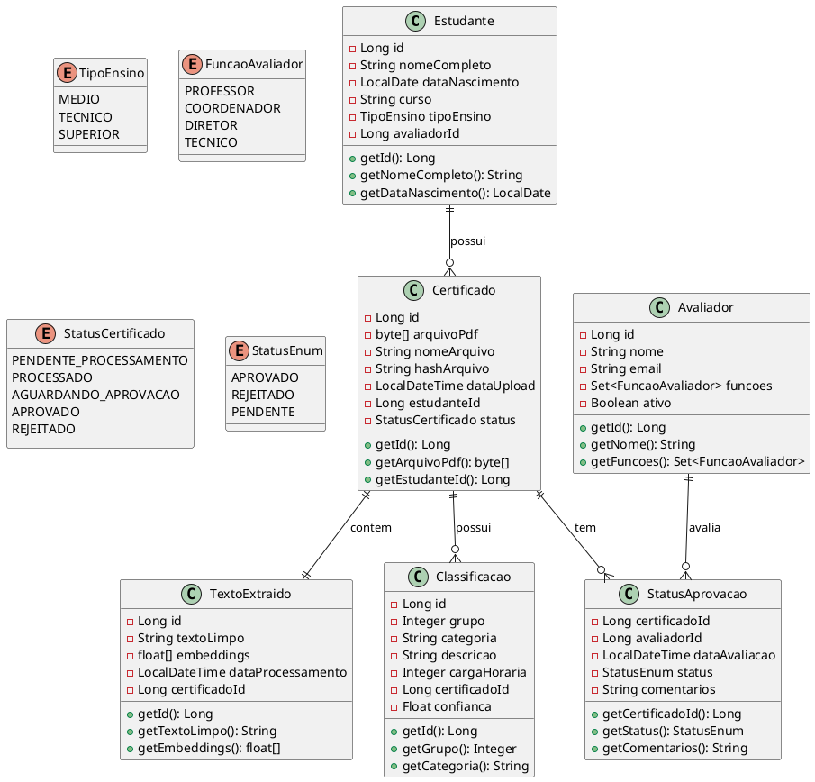
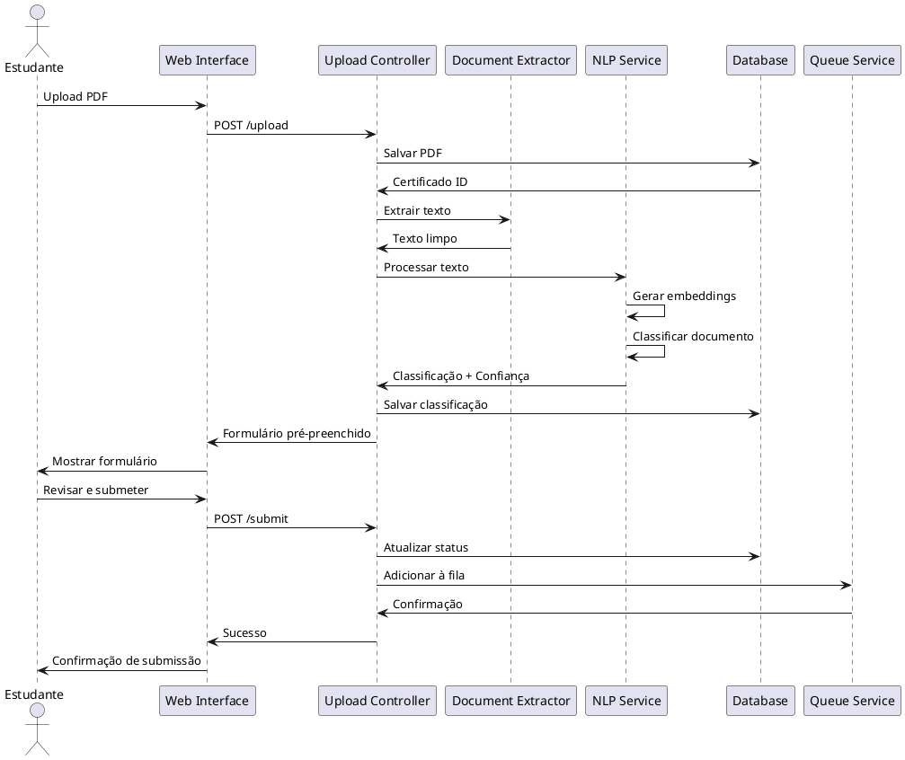
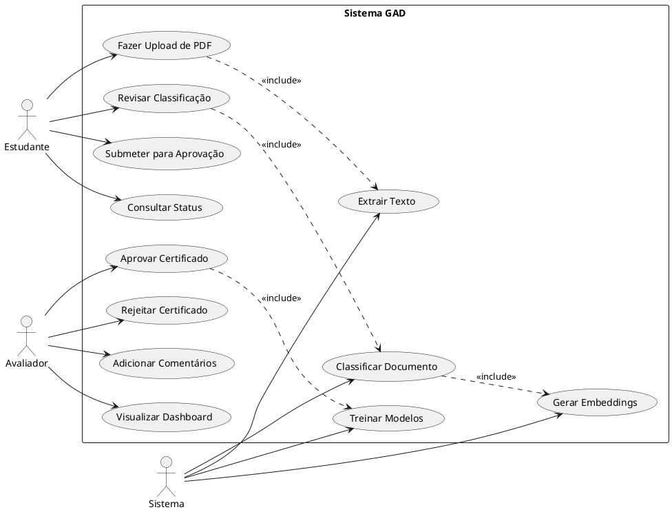
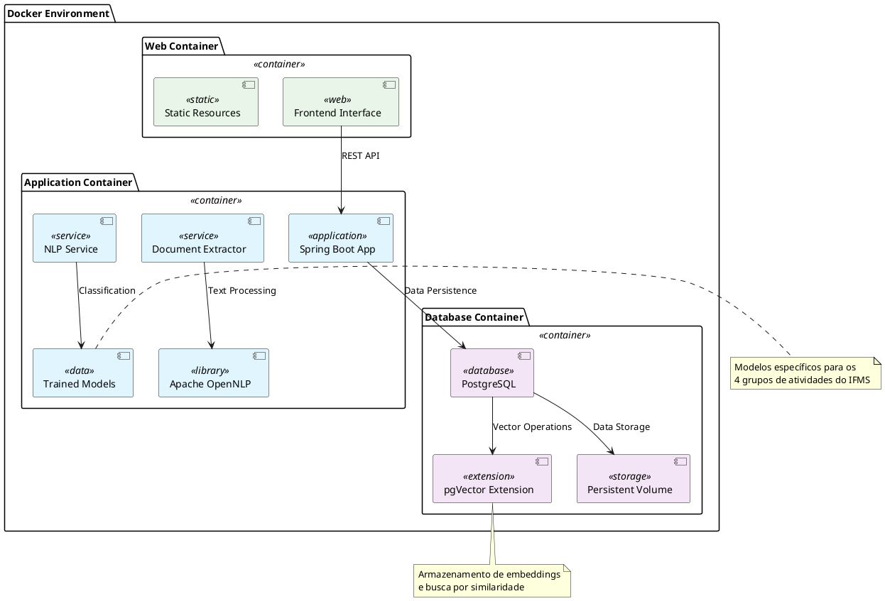

# Sistema GAD: Arquitetura para Classificação Automática de Certificados no IFMS

Este relatório apresenta uma análise técnica abrangente para o desenvolvimento do Sistema GAD (Gerenciamento de Atividades Diversificadas) do Instituto Federal de Mato Grosso do Sul, focando na classificação automática de certificados PDF através de técnicas de Machine Learning e Processamento de Linguagem Natural. A solução proposta integra Spring Framework, PostgreSQL com extensão pgVector, Apache OpenNLP e containerização Docker, seguindo arquitetura MVC e práticas ágeis de desenvolvimento. O sistema implementará um fluxo completo desde o upload de documentos até a aprovação por avaliadores, com pré-classificação automática baseada em modelos treinados localmente.

## Arquitetura do Sistema

### Componentes Principais

O Sistema GAD seguirá uma **arquitetura em camadas (MVC)** com separação clara de responsabilidades[^1_1]. A aplicação será estruturada em três módulos principais: o módulo de extração de texto (Document Extractor), o módulo de processamento de linguagem natural baseado no Apache OpenNLP, e o módulo de persistência utilizando PostgreSQL com extensão pgVector para armazenamento vetorial.

O **Document Extractor** será responsável pela extração e limpeza de texto dos arquivos PDF, removendo ruídos e formatações desnecessárias. Este módulo utilizará bibliotecas Java especializadas como Apache PDFBox ou iText para garantir extração precisa do conteúdo textual, lidando com diferentes layouts e formatações de certificados.

O **módulo de PLN** implementará algoritmos de classificação usando Apache OpenNLP, uma escolha estratégica por ser uma ferramenta madura, bem documentada e adequada para processamento de texto em português. Este módulo será responsável por tokenização, lematização, reconhecimento de entidades nomeadas e classificação automática dos documentos em categorias predefinidas.

### Banco de Dados Vetorial

O PostgreSQL com extensão **pgVector** proporcionará capacidades vetoriais nativas ao banco relacional tradicional[^1_1]. Esta escolha elimina a necessidade de sistemas de banco de dados especializados, mantendo a simplicidade arquitetural. Os embeddings gerados pelo Apache OpenNLP serão armazenados como vetores no PostgreSQL, permitindo buscas por similaridade e comparações eficientes entre documentos.

A extensão pgVector transformará o PostgreSQL em um banco de dados híbrido, capaz de armazenar tanto dados relacionais tradicionais (informações dos alunos, avaliadores, status de aprovação) quanto dados vetoriais (embeddings dos textos extraídos). Isso facilita a integração e reduz a complexidade de manter múltiplos sistemas de armazenamento.

## Modelagem de Dados

### Entidades Principais

A modelagem seguirá princípios de **normalização** e **integridade referencial**. As entidades principais incluem: Estudante, Avaliador, Certificado, TextoExtraido, Classificacao e StatusAprovacao[^1_1]. A entidade Estudante conterá informações básicas como nome completo, data de nascimento, curso e nível de ensino (médio, técnico ou superior).

A entidade **Certificado** armazenará o arquivo PDF como BLOB (Binary Large Object) no PostgreSQL, junto com metadados como data de upload, nome original do arquivo e hash para verificação de integridade. Esta abordagem garante que os arquivos originais sejam preservados para auditoria e reprocessamento futuro.

A entidade **TextoExtraido** manterá o texto limpo extraído do PDF em campo TEXT, vinculado ao certificado correspondente através de chave estrangeira. Adicionalmente, esta entidade incluirá um campo VECTOR para armazenar os embeddings gerados pelo processamento de PLN, permitindo buscas por similaridade semântica.

### Relacionamentos e Chaves

O relacionamento entre **Estudante e Avaliador** será de muitos-para-um, considerando que cada estudante possui um avaliador principal, mas um avaliador pode supervisionar múltiplos estudantes[^1_1]. Esta relação será implementada através de chave estrangeira na tabela Estudante, referenciando a chave primária do Avaliador.

O sistema implementará **chaves compostas** quando necessário, especialmente para rastrear o histórico de classificações e aprovações. Por exemplo, a tabela de StatusAprovacao utilizará chave composta incluindo ID do certificado, ID do avaliador e timestamp, permitindo rastrear mudanças de status ao longo do tempo.

## Processamento de Linguagem Natural

### Apache OpenNLP Integration

O Apache OpenNLP será integrado como biblioteca Java dentro da aplicação Spring, eliminando dependências externas e reduzindo latência de processamento[^1_1]. A escolha desta ferramenta se justifica pela sua maturidade, documentação abrangente e capacidade de processamento de texto em português brasileiro.

O treinamento inicial utilizará **100 documentos certificados** manualmente classificados para criar modelos específicos para os quatro grupos de atividades do IFMS. Cada grupo possui categorias distintas, e o sistema implementará classificadores especializados para cada grupo, melhorando a precisão da classificação automática.

O processamento seguirá pipeline estruturado: **tokenização** para divisão do texto em unidades menores, **lematização** para redução das palavras às suas formas canônicas, **reconhecimento de entidades nomeadas** para identificação de informações específicas (datas, instituições, tipos de atividade), e **classificação** propriamente dita baseada nos modelos treinados.

### Geração de Embeddings

Os **embeddings** serão gerados utilizando modelos de word embeddings do Apache OpenNLP, convertendo representações textuais em vetores numéricos de dimensão fixa. Estes vetores capturarão relações semânticas entre palavras e frases, permitindo que o sistema identifique padrões e similaridades entre diferentes tipos de certificados.

O armazenamento dos embeddings no pgVector permitirá **buscas por similaridade** eficientes, auxiliando na classificação de novos documentos através de comparação com documentos previamente classificados. Esta abordagem implementa uma forma de aprendizado por analogia, onde documentos similares tendem a receber classificações similares.

## Fluxo de Trabalho do Sistema

### Processo de Upload e Classificação

O fluxo iniciará com o **upload do PDF** pelo estudante através de interface web[^1_1]. O arquivo será temporariamente armazenado no servidor e processado pelo módulo Document Extractor, que extrairá e limpará o texto, removendo elementos gráficos, formatações desnecessárias e ruídos comuns em PDFs escaneados.

O texto limpo será processado pelo **módulo de PLN**, que aplicará os modelos treinados para gerar classificação automática. O sistema identificará automaticamente informações como carga horária, tipo de atividade, instituição emissora e outras características relevantes, preenchendo automaticamente o formulário de submissão.

O estudante revisará as **informações pré-preenchidas**, podendo corrigir eventuais erros antes de submeter para aprovação. Esta etapa de revisão humana é crucial para manter a qualidade dos dados e fornecer feedback para melhoria contínua dos modelos de classificação.

### Processo de Aprovação

Após submissão pelo estudante, o certificado entrará na **fila de aprovação** do avaliador correspondente[^1_1]. O dashboard do avaliador apresentará lista de certificados pendentes, organizados por prioridade e data de submissão, incluindo visualização do PDF original e informações classificadas automaticamente.

O avaliador poderá **aprovar ou rejeitar** cada submissão, incluindo comentários detalhados em caso de rejeição. Aprovações e rejeições serão registradas no banco de dados com timestamp e justificativa, criando histórico auditável de todas as decisões.

Certificados aprovados contribuirão para o **retreinamento dos modelos**, melhorando progressivamente a precisão da classificação automática. O feedback do avaliador será utilizado para ajustar pesos dos algoritmos e identificar padrões não capturados pelos modelos iniciais.

## Containerização com Docker

### Arquitetura de Containers

A solução utilizará **Docker Compose** para orquestrar três containers principais: aplicação Spring Boot, banco PostgreSQL e interface web[^1_1]. Esta abordagem garantirá portabilidade, facilidade de deployment e isolamento de dependências entre os componentes do sistema.

O **container da aplicação Spring** incluirá a JVM otimizada, bibliotecas do Apache OpenNLP, modelos treinados e todas as dependências necessárias. O Dockerfile utilizará imagem base do OpenJDK, configurando variáveis de ambiente para diferentes perfis (desenvolvimento, homologação, produção).

O **container PostgreSQL** incluirá a extensão pgVector pré-instalada e configurada, com scripts de inicialização para criação das tabelas e índices necessários. Este container montará volumes persistentes para garantir durabilidade dos dados mesmo durante atualizações da aplicação.

### Ambiente de Desenvolvimento

Para desenvolvimento local, o Docker Compose configurará **banco H2 em memória** para testes rápidos e PostgreSQL containerizado para desenvolvimento completo[^1_1]. Esta configuração dual permitirá execução de testes unitários sem dependências externas e desenvolvimento integrado com ambiente similar ao de produção.

O **IntelliJ IDEA** integrará diretamente com o Docker Compose através de plugins específicos, permitindo debugging da aplicação mesmo quando executada em containers. Esta configuração facilitará o desenvolvimento e reduzirá tempo de setup do ambiente.

## Diagramas UML

### Diagrama de Classes

### Diagrama de Sequência - Processo de Upload e Classificação

### Diagrama de Casos de Uso

### Diagrama de Arquitetura de Containers

## Implementação de Machine Learning

### Estratégia de Treinamento

O treinamento dos modelos será **supervisionado**, utilizando 100 certificados previamente classificados como conjunto de dados inicial[^1_1]. Esta abordagem garantirá qualidade dos dados de treinamento e permitirá avaliação objetiva da performance dos modelos através de métricas como precisão, recall e F1-score.

O **processo de treinamento** será incremental, incorporando novos dados conforme certificados são aprovados pelos avaliadores. Esta estratégia de aprendizado contínuo permitirá que o sistema melhore sua precisão ao longo do tempo, adaptando-se a novos tipos de certificados e mudanças nos padrões de classificação.

Serão implementados **algoritmos de classificação** específicos para cada grupo de atividades, considerando que cada grupo possui características e padrões distintos. Esta abordagem especializada resultará em maior precisão comparada a um classificador único genérico.

### Validação e Métricas

O sistema implementará **validação cruzada** para avaliar a performance dos modelos, dividindo o conjunto de dados em subconjuntos para treinamento e validação. Esta técnica identificará overfitting e garantirá que os modelos generalizem adequadamente para novos documentos.

Métricas de **confiança** acompanharão cada classificação automática, permitindo que o sistema identifique casos de baixa certeza que requerem revisão manual mais cuidadosa. Classificações com baixa confiança podem ser priorizadas na fila de aprovação dos avaliadores.

## Conclusão

O Sistema GAD representa uma solução técnica robusta e escalável para automatização da classificação de certificados no IFMS, combinando tecnologias maduras e bem documentadas. A arquitetura proposta integra eficientemente Spring Framework para o backend, PostgreSQL com pgVector para armazenamento híbrido relacional-vetorial, e Apache OpenNLP para processamento de linguagem natural, seguindo princípios de desenvolvimento limpo e modular.

A estratégia de containerização com Docker facilita deployment e manutenção, enquanto o design incremental do sistema de machine learning garante melhoria contínua da precisão de classificação. O fluxo de trabalho proposto equilibra automação com supervisão humana, mantendo controle de qualidade através da aprovação por avaliadores qualificados.

A implementação em fases, iniciando com MVP funcional e evoluindo gradualmente, permitirá validação precoce dos conceitos e ajustes baseados em feedback real dos usuários. Esta abordagem pragmática assegura que o sistema atenda efetivamente às necessidades específicas do IFMS, estabelecendo base sólida para futuras expansões e melhorias.

⁂

[^1_1]: paste.txt

